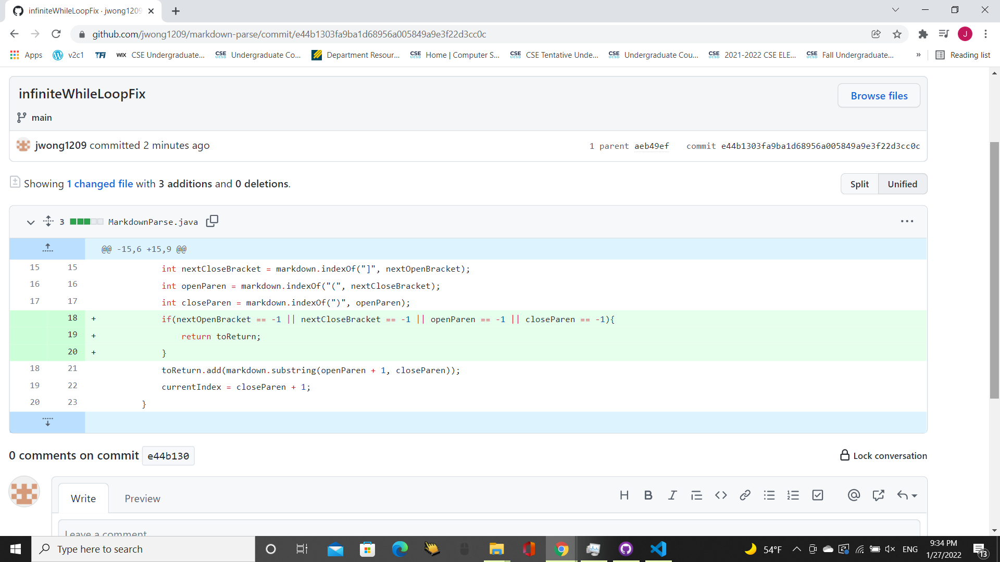
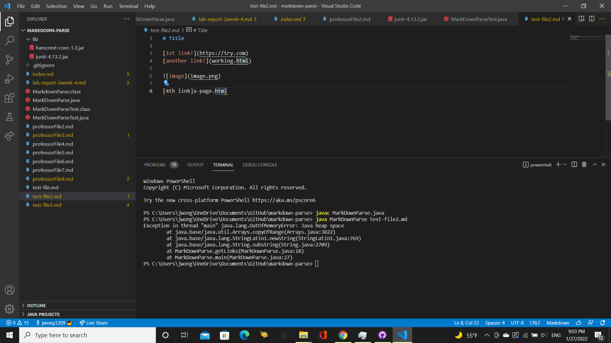
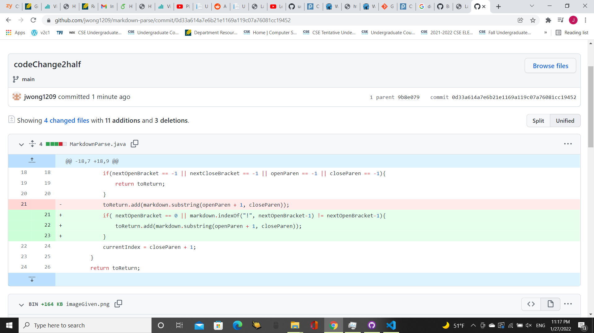
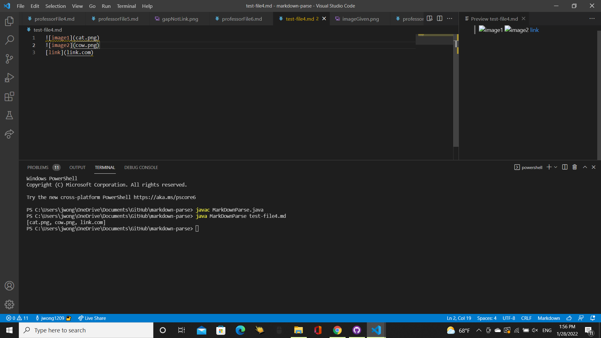
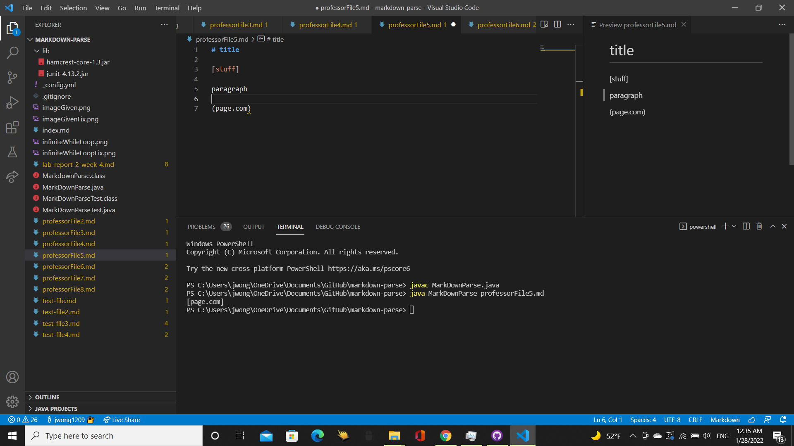
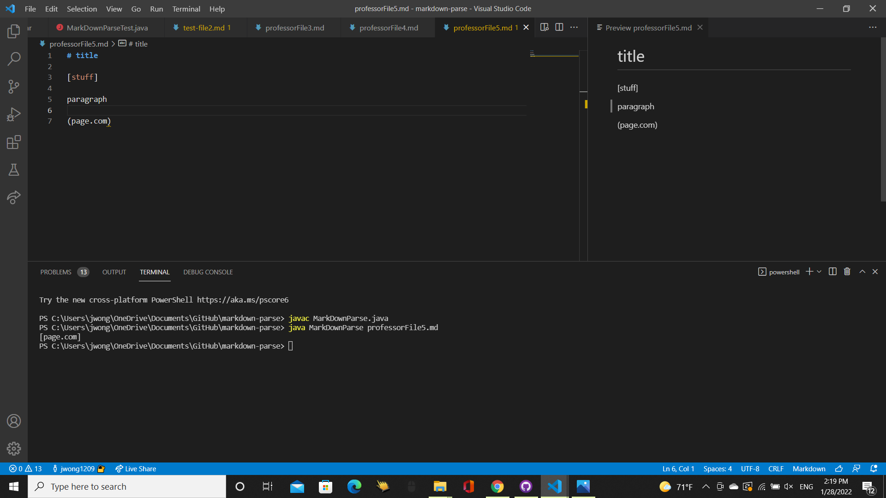

# **Lab Report 2 Week 4**

## Code Change 1: Fixing Infinite While Loop
Fix for Infinite While Loop: 

Link to Failure-Inducing File: [https://github.com/jwong1209/markdown-parse/blob/c0518531ee48080ba5e5c76d54f7290ab257f3be/test-file2.md](https://github.com/jwong1209/markdown-parse/blob/c0518531ee48080ba5e5c76d54f7290ab257f3be/test-file2.md)

Symptom of Failure-Inducing Input: 

Explanation: The line in the code `currentIndex = closeParen + 1` will reset the currentIndex back to the last parenthesis's index. This is an issue because if the last close parenthesis is not at the end as in the case of `test-file2.md`, then the condition `currentIndex < markdown.length()` would never be fulfilled and thus cause the while loop to keep repeating and the inside code to keep traversing through the file. This is fixed by checking if one of the variables is equal to -1 because at least one of them will be if you tried to find the indexOf a bracket or parenthesis during one of the while loop's faulty iterations.

## Code Change 2: Fixing Code Giving Images
Fix for Image: 

Link to Failure-Inducing File:[https://github.com/jwong1209/markdown-parse/blob/c0518531ee48080ba5e5c76d54f7290ab257f3be/test-file4.md](https://github.com/jwong1209/markdown-parse/blob/c0518531ee48080ba5e5c76d54f7290ab257f3be/test-file4.md)

Symptom of Failure-Inducing Input:

Explanation: The code only uses the index of the brackets and parenthesis to decide what is a link or not. Since the format for a image is nearly identical except that the image has a `!` at the beginning, this causes the code to identify images as links  such as `cat.png` and `cow.png` from the `test-file4.md` file and add them to `toReturn`. To fix this, I used the exclamation mark as the differentiator and if a `[` had a `!` in front of it, then it would not pass the `(nextOpenBracket == 0 || markdown.indexOf("!", nextOpenBracket-1) != nextOpenBracket-1)` part of the if statement. 

## Code Change 3: Fixing Code Giving Links When Gap Between
Fix for Code Giving Link Despite Characters Between Bracket and Parenthesis:

Link to Failure-Inducing File: 
[https://github.com/jwong1209/markdown-parse/blob/c0518531ee48080ba5e5c76d54f7290ab257f3be/professorFile5.md](https://github.com/jwong1209/markdown-parse/blob/c0518531ee48080ba5e5c76d54f7290ab257f3be/professorFile5.md)

Symptom of Failure-Inducing File:

Explanation: The code only looks at where the `[` is and then the `]` and then the `(` and then the `)` is but does not take into account the distance between the `]` and`(`. That means even though in `professorFile5.md` there are characters between the `]` and `(`, it still prints `page.com` as if it were a correctly formatted link when it should not since there are characters in between. The fix for this was checking that the `]` and `(` were right next to each other by adding `(openParen - nextCloseBracket == 1)` into the if statement.