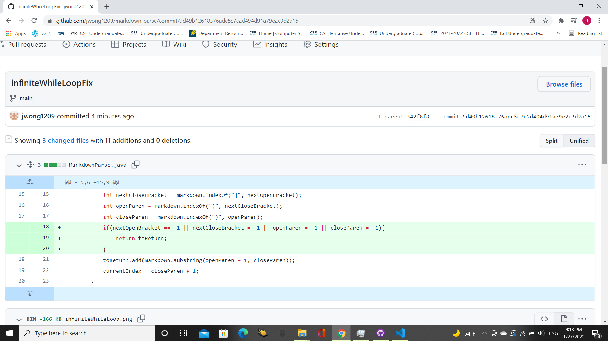

# **Lab Report 2 Week 4**

## Code Change 1: Fixing Infinite While Loop
Fix for Infinite While Loop: 

Link to Failure-Inducing File: [https://github.com/jwong1209/markdown-parse/blob/main/test-file2.md](https://github.com/jwong1209/markdown-parse/blob/main/test-file2.md)

Symptom of Failure-Inducing Input: 

Explanation: The line in the code `currentIndex = closeParen + 1;` will reset the currentIndex back to the last parenthesis found, and then do the indexOf method from there causing a return of -1 and 
